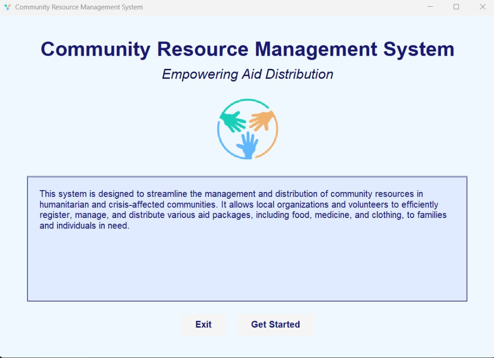
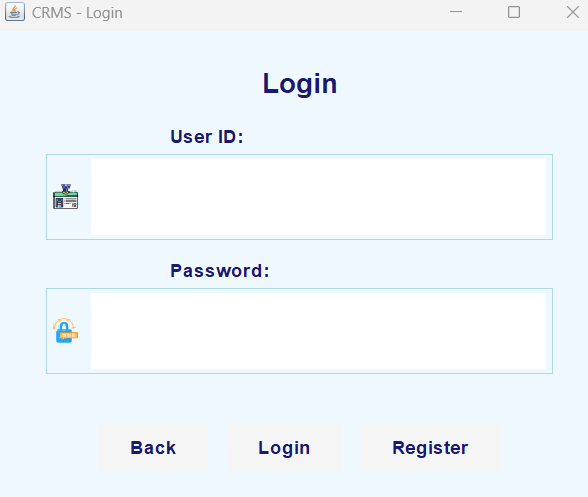
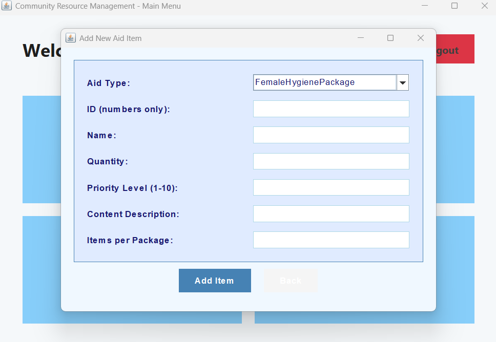

# Community Resource Management System

Java course project. A desktop application for nonprofit organizations that register people in need, track aid stock, and record how food, clothing, medicine, and hygiene packages are distributed.

## Screenshots

### Welcome

The application opens with a short description of the system and a path into login or registration.



### Login

Users sign in with an ID and password. New accounts are created from the same screen.



### Add aid item

Staff register stock by type, including food, clothing, medicine, and hygiene packages. Each item has an ID, quantity, priority, and type-specific details.



## What the system does

- Register beneficiaries, volunteers, and organization staff, each with a unique ID.
- Authenticate users and show a menu that matches their role.
- Add aid items, search them, and list only items that are in stock and not expired.
- Let beneficiaries request aid.
- Let staff assign and distribute aid, then keep a timestamped record of each distribution.
- Reduce stock automatically when an item is distributed.
- Produce a distribution report.

## Roles

| Role | Access |
| --- | --- |
| Beneficiary | View available aid and submit requests |
| Volunteer | Deliver aid and review distributions |
| Organization staff | Full access, including stock, assignment, and reports |

## Technologies

- Java 8 or later
- Java Swing
- `ArrayList` for people, stock, requests, and distributions
- Streams for search and filtering
- Inheritance and interfaces for users and aid types

## Getting started

Requirements: JDK 8 or higher.

Compile and run from the project root:

```bash
javac -encoding UTF-8 -d bin src/Stage1/*.java src/Stage2/*.java
java -cp bin Stage2.Main
```

In an IDE, run `src/Stage2/Main.java`.

On first launch, register a user, then sign in. Staff accounts can add stock. Beneficiary accounts can request what is available.

## Project structure

```
src/
├── Stage1/                         Core model
│   ├── Person.java                 Base type for every user
│   ├── Beneficiary.java
│   ├── Volunteer.java
│   ├── OrganizationStaff.java
│   ├── AidItem.java                Base type for stock
│   ├── ExpirableItem.java
│   ├── FoodPackage.java
│   ├── ClothingPackage.java
│   ├── Medicine.java
│   ├── FemaleHygienePackage.java
│   ├── Request.java
│   ├── Distribution.java
│   ├── Distributable.java
│   └── AidManagement.java          Registration, stock, and distribution
└── Stage2/                         Swing interface
    ├── Main.java
    ├── WelcomeScreen.java
    ├── LoginScreen.java
    ├── RegistrationScreen.java
    ├── MainMenuScreen.java
    ├── AddAidItemScreen.java
    ├── ViewAidScreen.java
    ├── RequestAidScreen.java
    ├── AssignAidScreen.java
    ├── DistributeAidScreen.java
    └── DistributionReportScreen.java
```

## Design

`Person` is the base for beneficiaries, volunteers, and staff. `AidItem` is the base for every package. Food and medicine extend `ExpirableItem`, so availability checks can ignore expired stock. `AidManagement` implements `Distributable` and is the single place that registers users, stores items, processes requests, and records distributions.

Data stays in memory for the life of the process. Closing the application clears it. Passwords are stored as plain text because this is a coursework project, not a production system.

## License

Educational use.
